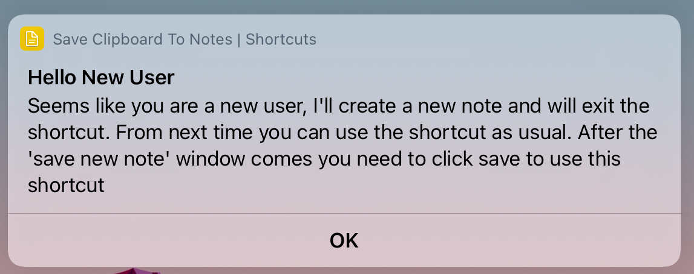
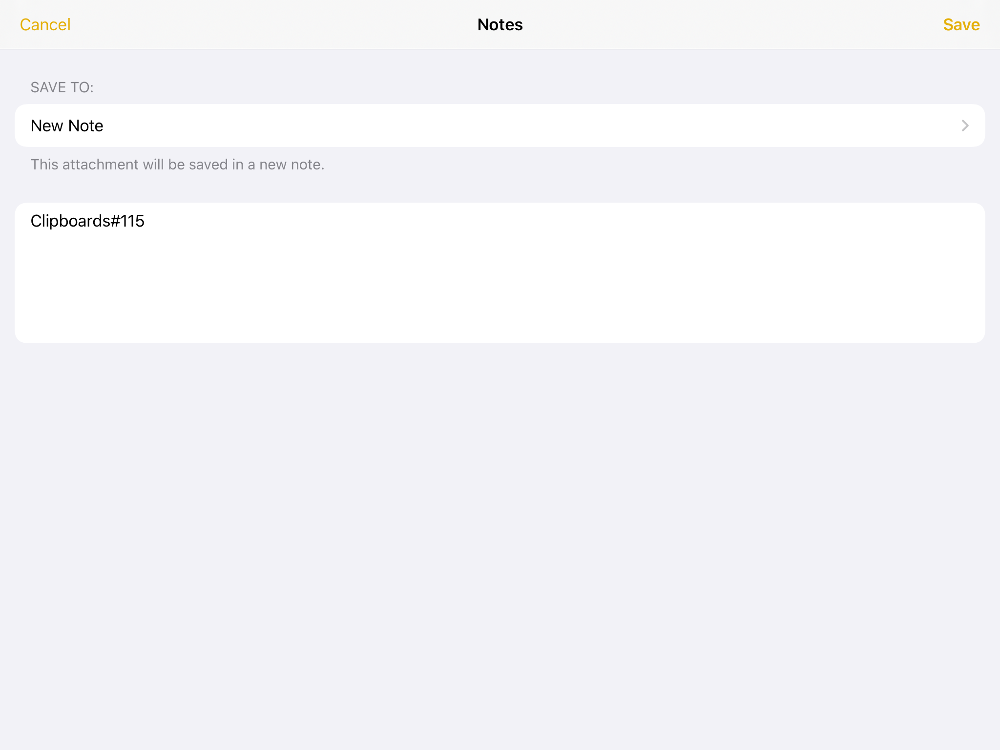
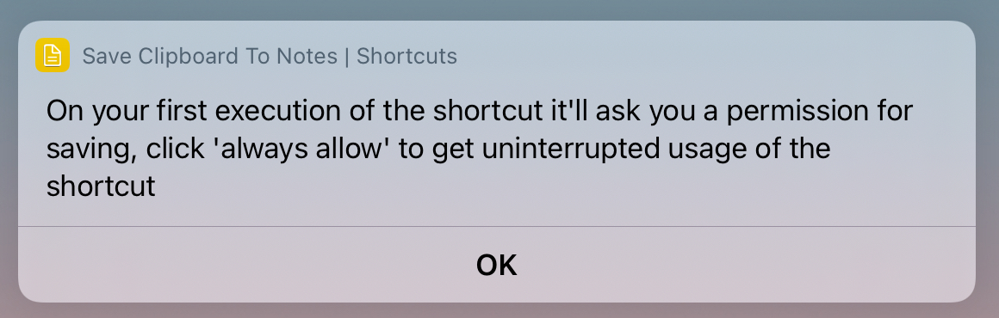
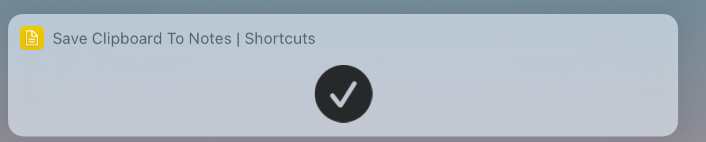
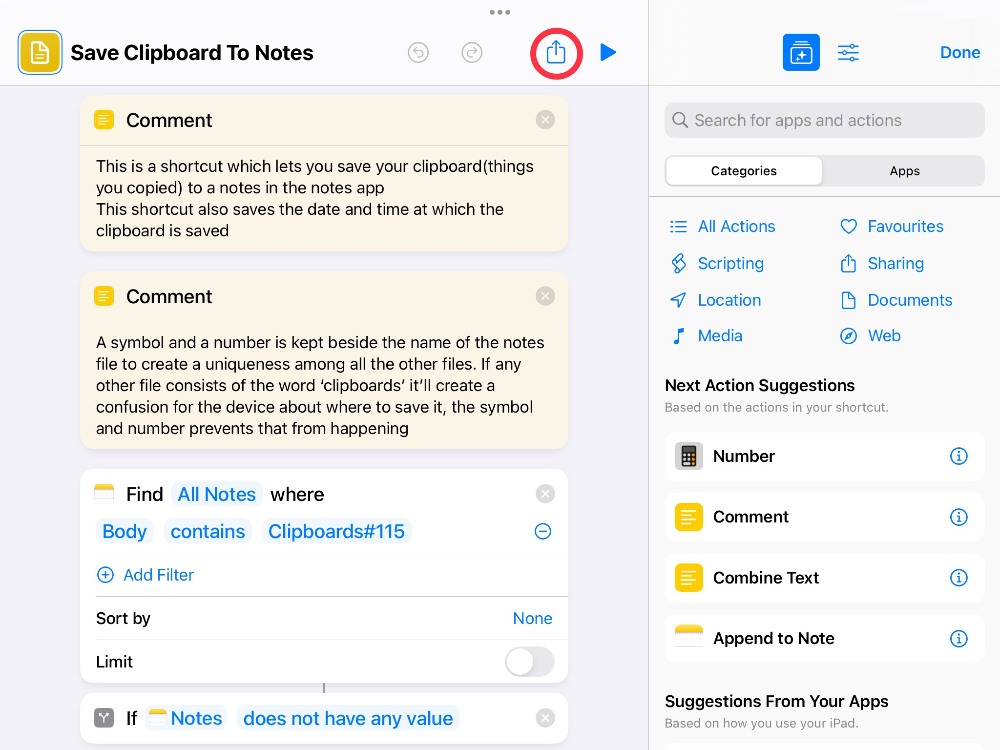
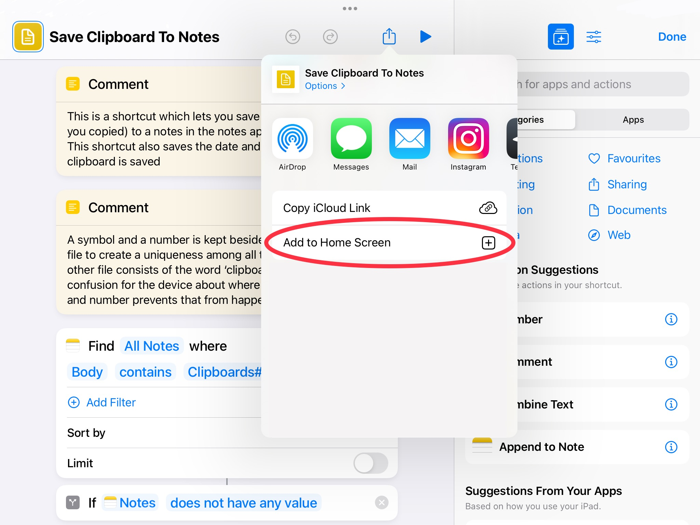
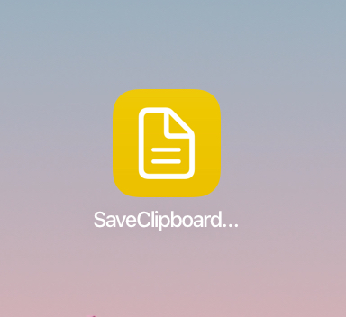

# Save Clipboard using Shortcuts

This is a shortcut which lets you save your clipboard to the note in the notes app. You can save most of the types of formats from your clipboard.

> You can save the shortcut to your device using the file on the [releases](https://github.com/dhivijit/save-clipboard-shortcut/releases/tag/main) page or via the [iCloud link](https://www.icloud.com/shortcuts/fb8348d9f487425f8e6894b857822d87), I suggest to save the shortcut using the file.
> 
> You require iOS 15 or greater to add the shortcut using the file

---
## Running the shortcut

After copying anything to your clipboard, you can execute the shortcut which will save your clipboard to the note created by the shortcut

---

## Setting Up
---
### First Run
- On running the shortcut for the first time, it will greet the user and gives the message about the first run.

- Next it will prompt the user to create a note and the user has to save it for further usage of the shortcut.

- After saving the note, the user will be given another alert to give the shortcut the permission for access to the notes app for uninterrupted usage of the shortcut

- After doing all these steps you will be shown that the shortcut is completed

> The note created by the shortcut in this step is where all your clipboards will be saved

---

### Easy Access of the shortcut

You may want to execute the shortcut easily without going to the shortcuts app all the time for saving your clipboard

You need to do the following steps to get easy access

- Click the button which is marked with the red circle

- Now click the button 'Add to Home Screen'

- And after doing that the shortcut will be added to the home screen

- Now you can execute the shortcut to save whatever you copied

---
> All the screenshots are taken on an iPad running iPadOS 15. The above steps can be different if your device is running other OS
